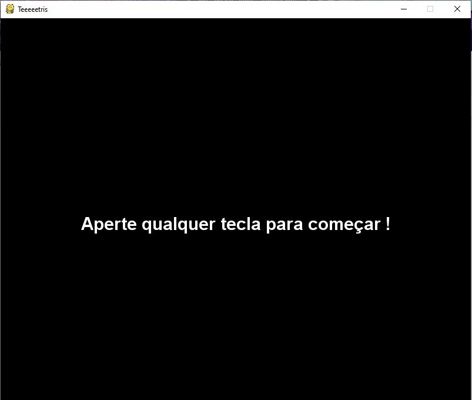
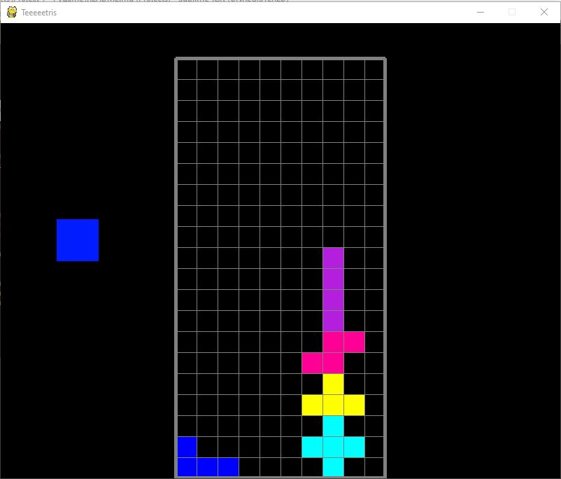
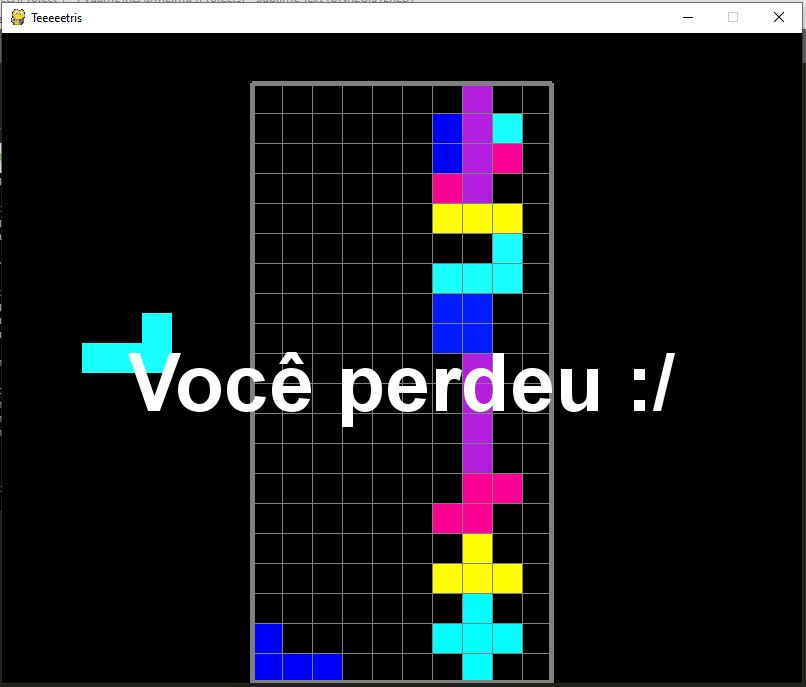

# 🎮 Project 1 | Pygame - Tetris 

<p align="center">
  
</p>


## Descrição
Projeto desenvolvido na primeira semana de estudo na Ironhack. Neste projeto, foi feito um Tetris, utilizando a biblioteca do Pygame.

## Status do Projeto
Concluido ✅

## Pré-requisito
1. [Python](https://www.python.org/)
2. [Jupyter Notebook](https://jupyter.org/try)
3. [Pygame](https://www.pygame.org/wiki/GettingStarted)

## Como rodar o jogo
No terminal, clone o projeto:
```
git clone https://github.com/yguenka/IronHack-Projects/blob/master/Project%201%20-%20Pygame/My%20-%20quase%20-Tetris.ipynb
```

Instale o a biblioteca [Pygame](https://pypi.org/project/pygame/):

```
pip install pygame --user 
```

Verificar a versão:
```
pygame.__version__=='1.9.6'
```
Abrir o Jupyter Notebook e rodar o código clonado.

As imagens abaixo mostram o tetris ao decorrer do jogo.
<p align="center">
  
</p>

<p align="center">
  
</p>

<p align="center">
  
</p>


## Autores
+ **Yukari Guenka Yshida**

## Agradecimentos
+ [André Aguiar](https://github.com/aguiarandre)
+ [Matheus Lavado](https://github.com/matheuslavado)
+ [Lucas White Rossi](https://github.com/LucasWhiteRossi)
+ [Raiana Rocha](https://github.com/Rairocha)
+ [Tech With Tim](https://techwithtim.net/tutorials/game-development-with-python/tetris-pygame/tutorial-1/)